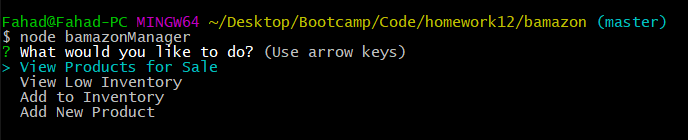

# Week of 12 HW: Node.js & MySQL

## Overview

Bamazon is an Amazon-like storefront using MySQL to track inventory. The Bamazon app will take in orders from customers and deplete stock from the store's inventory. As a bonus, the app will track product sales across your store's departments and then provide a summary of the highest-grossing departments in the store.

## Challenges

### Challenge #1: Customer View (Minimum Requirement)
#### Succesful customer transaction

#### Out of inventory response

### Challenge #2: Manager View (Next Level)
#### Manager Menu

#### View products for sale - list all products for sale with associated stock levels.

#### View low inventory - list all products with inventory lower than five.

#### Add to inventory - increase stock of a selected item.

#### Add new product - add a new product.

### Challenge #3: Supervisor View (Final Level)
#### Supervisor Menu

#### View product sales by department - view total sales by department
 

#### Create new department - Create a new department

## Copyright

Fahad Rahman (C) 2017. All Rights Reserved.
